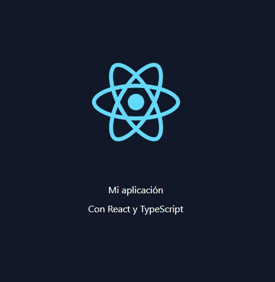

# Aplicación de recordatorios

Aplicación creada con ReactJs, Net Core 5, TailwindCSS y TypeScript.

`Esta aplicación fue realizada con fines de aprendizaje, la integración
de ReactJS 18 sobre net core 5 podría traer bugs desconocidos.`

## Requerimientos

- ReactJS >=16
- Net Core = 5
- Nodejs 'LTS'
- TypeScript >= 4.9
- TailwindCSS ~3.3

## Configuración

- Crear un proyecto usando la plantilla Net con ReactJS en VS 2022
- Eliminar la carpeta ClientApp
- Si queremos usar TypeScript, podemos ejecutar el siguiente
  comando con la opción template dentro del directorio donde antes
  estaba ClientApp

```bash
# El nombre ClientApp se remplazo por client-app por razones del gestor npm
$ npx create-react-app client-app --template typescript
```

- Editar el archivo del proyecto _.csproj_ en mi caso (My-reminder.csproj)

```csharp
// En propertygroup cambiar el nombre del spa a client-app
// antes
  <SpaRoot>ClientApp\</SpaRoot>
// después
  <SpaRoot>client-app\</SpaRoot>
```

- Editar el archivo Startup.cs

```csharp
// Cambiar todas las apariciones de ClientApp por client-app
// antes
  spa.Options.SourcePath = "client-app";
  configuration.RootPath = "client-app/build";
// después
  spa.Options.SourcePath = "client-app";
  configuration.RootPath = "client-app/build";
```

- Instalar _ts-node_ y _@types/node_ en modo desarrollo

```bash
# Ejecutar dentro del directorio client-app
$ npm i ts-node @types/node -D
```

- Cambiar _ES5_ a _ES6_ y _esnext_ en _tsconfig.json_

```json
"target": "es6",
"module": "esnext",
```

### Iniciar la aplicación desde VS 2022 usando IIS Express

## Si la aplicación no funciona

Agregar la opción _module_ a _package.json_

```json
"type": "module"
```

Verificar la instalación de _NodeJS_

Verificar el _PATH_ del sistema _(nodejs, npm, npx, etc)_

Reiniciar _Visual Studio 2022_

## Instalación de TailwindCSS

`Ejecutar todos los comandos dentro del directorio client-app`

- [Seguir los pasos de la doc oficial hasta el punto 4](https://tailwindcss.com/docs/guides/create-react-app)

- Eliminar el archivo _App.css_

- Eliminar el contenido de _index.css_

- Agregar los siguientes estilos generales a _index.css_

```css
/* index.css */
@tailwind base;
@tailwind components;
@tailwind utilities;

* {
  margin: 0;
  padding: 0;
  box-sizing: 0;
}
```

- Agregar algunas clases a App.tsx

```typescript
import logo from './logo.svg';

function App() {
  return (
    <div className="bg-gray-900 flex h-screen items-center justify-center">
      <header className="flex flex-col gap-2 text-white text-center">
        
        <p>Mi aplicación</p>
        <a href="https://reactjs.org" target="_blank" rel="noopener noreferrer">
          Con React y TypeScript
        </a>
      </header>
    </div>
  );
}

export default App;
```

Resultado:



- Reiniciar la aplicación desde VS 2022

## Referencias

- [Net-React-TypeScript-Template](https://bradshawdotnet.hashnode.dev/net-react-typescript-template)

- [TailwindCSS using Create-react-app](https://tailwindcss.com/docs/guides/create-react-app)

## Acerca de
