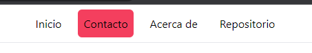
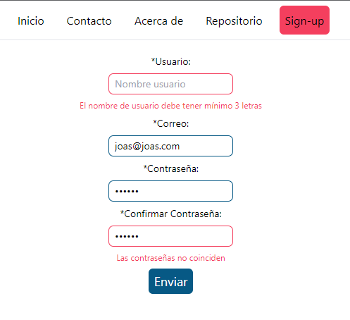

# Aplicación de recordatorios

Aplicación creada con ReactJs, Net Core 5, TailwindCSS y TypeScript.

`Esta aplicación fue realizada con fines de aprendizaje, la integración
de ReactJS 18 sobre net core 5 podría traer bugs desconocidos.`

## Tabla de contenidos

- [Aplicación de recordatorios](#aplicación-de-recordatorios)
  - [Tabla de contenidos](#tabla-de-contenidos)
  - [Requerimientos](#requerimientos)
  - [Configuración](#configuración)
    - [Iniciar la aplicación desde VS 2022 usando IIS Express](#iniciar-la-aplicación-desde-vs-2022-usando-iis-express)
  - [Instalación de TailwindCSS](#instalación-de-tailwindcss)
  - [Instalar React-Router-Dom v6](#instalar-react-router-dom-v6)
  - [Instalar Tailwind-merge y clsx](#instalar-tailwind-merge-y-clsx)
  - [Instalación de React-Hook-Form y Zod](#instalación-de-react-hook-form-y-zod)
  - [Refactor de rutas](#refactor-de-rutas)
  - [Referencias](#referencias)
  - [Acerca de](#acerca-de)

## Requerimientos

- ReactJS >=16
- Net Core = 5
- Nodejs 'LTS'
- TypeScript >= 4.9
- TailwindCSS ~3.3
- React-router-dom ~6.19

## Configuración

- Crear un proyecto usando la plantilla Net con ReactJS en VS 2022
- (opcional) Si se quiere usar un control de versiones sobre todo el proyecto en general, antes de eliminar app, crear un repositorio local desde la carpeta del proyecto.
- Eliminar la carpeta ClientApp
- Si queremos usar TypeScript, podemos ejecutar el siguiente
  comando con la opción template dentro del directorio donde antes
  estaba ClientApp

```bash
# El nombre ClientApp se remplazo por client-app por razones del gestor npm
npx create-react-app client-app --template typescript
```

- Editar el archivo del proyecto _.csproj_ en mi caso (My-reminder.csproj)

```csharp
// En propertygroup cambiar el nombre del spa a client-app
// antes
  <SpaRoot>ClientApp\</SpaRoot>
// después
  <SpaRoot>client-app\</SpaRoot>
```

- Editar el archivo Startup.cs

```csharp
// Cambiar todas las apariciones de ClientApp por client-app
// antes
  spa.Options.SourcePath = "client-app";
  configuration.RootPath = "client-app/build";
// después
  spa.Options.SourcePath = "client-app";
  configuration.RootPath = "client-app/build";
```

- Instalar _ts-node_ y _@types/node_ en modo desarrollo

```bash
# Ejecutar dentro del directorio client-app
npm i ts-node @types/node -D
```

- Cambiar _ES5_ a _ES6_ y _esnext_ en _tsconfig.json_

```json
"target": "es6",
"module": "esnext",
```

### Iniciar la aplicación desde VS 2022 usando IIS Express

`Si la aplicación no funciona`

Agregar la opción _module_ a _package.json_

```json
"type": "module"
```

Verificar la instalación de _NodeJS_

Verificar el _PATH_ del sistema _(nodejs, npm, npx, etc)_

Reiniciar _Visual Studio 2022_

## Instalación de TailwindCSS

`Ejecutar todos los comandos dentro del directorio client-app`

- [Seguir los pasos de la doc oficial hasta el punto 4](https://tailwindcss.com/docs/guides/create-react-app)

- Eliminar el archivo _App.css_

- Eliminar el contenido de _index.css_

- Agregar los siguientes estilos generales a _index.css_

```css
/* index.css */
@tailwind base;
@tailwind components;
@tailwind utilities;

* {
  margin: 0;
  padding: 0;
  box-sizing: 0;
}
```

- Agregar algunas clases a _App.tsx_

```tsx
// App.tsx
import logo from './logo.svg';

function App() {
  return (
    <div className="bg-gray-900 flex h-screen items-center justify-center">
      <header className="flex flex-col gap-2 text-white text-center">
        
        <p>Mi aplicación</p>
        <a href="https://reactjs.org" target="_blank" rel="noopener noreferrer">
          Con React y TypeScript
        </a>
      </header>
    </div>
  );
}

export default App;
```

Resultado:


- Reiniciar la aplicación desde VS 2022

## Instalar React-Router-Dom v6

- Instalar usando la documentación oficial

```bash
npm i react-router-dom
```

- Crear la carpeta components dentro de src y agregar

  - About.tsx
  - Contact.tsx
  - Home.tsx
  - Navbar.tsx
  - Repo.tsx

- Crear el componente _Navbar.tsx_ para pruebas

```tsx
// Navbar.tsx
import { NavLink } from 'react-router-dom';

type Props = {};

const Navbar = (props: Props) => {
  return (
    <ul className="flex items-center justify-center gap-4 border-b h-14">
      <li>
        <NavLink
          to={'/'}
          className={({ isActive }) =>
            [
              'px-2 py-2.5 hover:bg-sky-300 hover:text-slate-100 rounded-md transition',
              isActive ? 'bg-rose-500' : '',
            ].join(' ')
          }
        >
          Inicio
        </NavLink>
      </li>
      <li>
        <NavLink
          to={'/contact'}
          className={({ isActive }) =>
            [
              'px-2 py-2.5 hover:bg-sky-300 hover:text-slate-100 rounded-md transition',
              isActive ? 'bg-rose-500' : '',
            ].join(' ')
          }
        >
          Contacto
        </NavLink>
      </li>
      <li>
        <NavLink
          to={'/about'}
          className={({ isActive }) =>
            [
              'px-2 py-2.5 hover:bg-sky-300 hover:text-slate-100 rounded-md transition',
              isActive ? 'bg-rose-500' : '',
            ].join(' ')
          }
        >
          Acerca de
        </NavLink>
      </li>
      <li>
        <NavLink
          to={'/repo'}
          className={({ isActive }) =>
            [
              'px-2 py-2.5 hover:bg-sky-300 hover:text-slate-100 rounded-md transition',
              isActive ? 'bg-rose-500' : '',
            ].join(' ')
          }
        >
          Repositorio
        </NavLink>
      </li>
    </ul>
  );
};

export default Navbar;
```

- Escribir el siguiente código en _App.tsx_

```tsx
// App.tsx
import { BrowserRouter, Route, Routes } from 'react-router-dom';
import About from './components/About';
import Contact from './components/Contact';
import Home from './components/Home';
import Navbar from './components/Navbar';
import Repo from './components/Repo';

function App() {
  return (
    <BrowserRouter>
      <Navbar />
      <Routes>
        <Route path="/" element={<Home />}></Route>
        <Route path="/contact" element={<Contact />}></Route>
        <Route path="/about" element={<About />}></Route>
        <Route path="/repo" element={<Repo />}></Route>
      </Routes>
    </BrowserRouter>
  );
}

export default App;
```

Verificamos el funcionamiento, si por alguna razón no funciona, reiniciamos el proyecto debido a la instalación de react-router-dom

Resultado:



## Instalar Tailwind-merge y clsx

Estas dos librerías en conjunto permiten mezclar las clases correctamente de tailwind y al crear una función de utilidad que podemos utilizar
en cualquier parte del código, no solo en links.

```bash
npm i tailwind-merge clsx
```

Dentro de _client-app/src_ creamos el folder _lib_
el cual nos permitirá crear funciones helper para reutilizar en todo el proyecto

Dentro de lib, creamos el archivo _utils.ts_

En este archivo, escribiremos las funciones de utilidad, en este caso la
función _cn_ para combinar las clases.

```tsx
// lib/utils.ts
import { clsx, type ClassValue } from 'clsx';
import { twMerge } from 'tailwind-merge';

export function cn(...inputs: ClassValue[]) {
  return twMerge(clsx(inputs));
}
```

Si la utilizamos en nuestros _Navlink_ en lugar de usar .join y un array, queda mejor el código y ademas la función no se cierra unicamente a los links, permitiéndonos usarla en varios componentes.

```tsx
// Ejemplo de un navlink usando la función cn
// La función cn, recibe las clases por default, y después de la comma
// podemos agregar mas condicionales, dado que los inputs recibidos son un arreglos de strings (ClassValues).

<NavLink
  to={'/'}
  className={({ isActive }) =>
    cn(
      'px-2 py-2.5 hover:bg-sky-300 hover:text-slate-100 rounded-md transition',
      isActive ? 'bg-rose-500' : '',
    )
  }
>
  Inicio
</NavLink>
```

## Instalación de React-Hook-Form y Zod

`Recordatorio, ejecutar sobre client-app`

```bash
npm i react-hook-form zod @hookform/resolvers
npm i react-icons
```

React-icons es una lib para utilizar algunos iconos especiales.

- Creamos un componente llamado _Signup.tsx_ el cual nos permitirá probar todo a la vez, React-hook-form, zod, resolver y el icono de react.
- Agregamos las rutas y componente a _App.tsx_
- Agregamos el link de navegación en _Navbar.tsx_

Verificamos el funcionamiento con el código agregado a _Signup.tsx_



## Refactor de rutas

Tener un mejor control del flujo del sitio/aplicación web nos ayuda a
escalarlo sin la necesidad de modificar demasiado código.

Para tener una mejor estructura de navegación con react router, vamos a implementar
la carpeta _pages_, dentro una sub-carpeta con el nombre del componente _Home_ por ejemplo y en dicha sub-carpeta el archivo _index.tsx_, el cual sera importado automáticamente con un enrutador (handcrafted).

- Creamos la carpeta _pages_ dentro de _src_
- Añadimos un subdirectorio para cada link a una pagina
  - Home
  - Contact
  - etc...
- Añadimos los archivos _index.tsx_ en cada directorio nuevo
- En Auth, agregamos dos subdirectorios para el sign-in y el sign-up
- Debido al uso de TypeScript, creamos la carpeta Types para los tipos de los route que vamos a generar y sus child routes.
- En _pages_ agregamos dos archivos nuevos para configurar nuestros paths y para generar las rutas automáticamente.

_/src/types/router.types.ts_

```ts
// children => Opcional en caso de no tener nested routes
export interface routerType {
  title: string;
  path: string;
  element: JSX.Element;
  children?: routerType[];
}
```

_pagesData.tsx_

```tsx
// pagesData.tsx - Objeto para las rutas
import { routerType } from '../types/router.types';
import About from './About';
import Signin from './Auth/Signin';
import Signup from './Auth/Signup';
import Contact from './Contact';
import Error from './Error';
import Home from './Home';
import Landing from './Landing';
import Repo from './Repo';

const pagesData: routerType[] = [
  {
    title: 'Error',
    path: '*',
    element: <Error />,
  },
  {
    title: 'home',
    path: '/',
    element: <Home />,
  },
  {
    title: 'about',
    path: 'about',
    element: <About />,
  },
  {
    title: 'contact',
    path: 'contact',
    element: <Contact />,
  },
  {
    title: 'repo',
    path: 'repo',
    element: <Repo />,
  },
  {
    title: 'auth',
    path: 'auth',
    element: <Landing />,
    children: [
      {
        path: 'sign-in',
        element: <Signin />,
        title: 'sign-in',
      },
      {
        path: 'sign-up',
        element: <Signup />,
        title: 'sign-up',
      },
    ],
  },
];

export default pagesData;
```

_router.tsx_

```tsx
// Funciones para añadir las rutas y sus hijos si existen
import { Route, Routes } from 'react-router-dom';
import { routerType } from '../types/router.types';
import pagesData from './pagesData';

const renderRoutes = (routes: routerType[]) => {
  return routes.map(({ title, path, element, children = [] }) => {
    return (
      <Route key={title} path={path} element={element}>
        {children.length > 0 && <Route>{renderRoutes(children)}</Route>}
      </Route>
    );
  });
};

const Router = () => {
  const pageRoutes = renderRoutes(pagesData);
  return <Routes>{pageRoutes}</Routes>;
};

export default Router;
```

_App.tsx_

```tsx
// App.tsx -> Cambia la forma de renderizar las rutas
import { BrowserRouter } from 'react-router-dom';
import Navbar from './components/Navbar';
import Router from './pages/router';

function App() {
  return (
    <BrowserRouter>
      <Navbar />
      <Router />
    </BrowserRouter>
  );
}

export default App;
```

Las ventajas de hacerlo de esta manera son las siguientes:

- Código limpio/estructurado/fácil de mantener.
- Estilos CSS en carpetas separadas para cada sitio.
- Fácil adhesion de rutas protegidas/privadas.
- Separar componentes de sitios específicos.
- Aplicar layout globales para N paginas.

Las desventajas encontradas:

- Cerrar algunas funciones especificas con los routes

## Referencias

- [Net-React-TypeScript-Template](https://bradshawdotnet.hashnode.dev/net-react-typescript-template)

- [TailwindCSS using Create-react-app](https://tailwindcss.com/docs/guides/create-react-app)

- [Using clsx with tailwind-merge](https://akhilaariyachandra.com/snippets/using-clsx-or-classnames-with-tailwind-merge)

- [The right way to structure your react router](https://dev.to/kachiic/the-right-way-structure-your-react-router-1i3l)

## Acerca de
